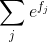

# CS231n - Lecture 3 notes

[Stanford University CS231n, Spring 2017 - Lecture 3](https://www.youtube.com/watch?v=h7iBpEHGVNc&list=PLC1qU-LWwrF64f4QKQT-Vg5Wr4qEE1Zxk&index=2)

## Loss Function and Optimization

1. **Loss function** that quantifies our unhappiness with the scores across the training data.
    - Also referred to as the **cost function** or the **objectif=ve**
2. Efficiently finding the parameters that minimize the loss function **(optimization)**.

Given an example (x<sub>i</sub>, y<sub>i</sub>) where x<sub>i</sub> is the pixel values of the image and where y<sub>i</sub> is the label or target (integer).

Loss over the dataset is a sum of loss over examples:


We have to define some loss function L_i which will take in the predicted scores coming out of the function *f* together with the true target or label Y and give us some quantitative value for how bad tose predictions are for that training example.

The final loss L will be the average of these losses summed over the entire dataset over each of the N examples.

### Multiclass Support Vector Machine (SVM) loss

Given an example (x<sub>i</sub>, y<sub>i</sub>) where x<sub>i</sub> is the pixel values of the image and where y<sub>i</sub> is the label or target (integer) and using the shorthand for the scores vector. 

- s<sub>j</sub> = f(x<sub>i</sub>, W)<sub>j</sub>

The SVM loss has the form:


The loss L_i for any individual example, we're going to perform a sum over all of the categories Y except for the true category Y_i.

So we're going to sum over all the incorrect categories, and then we're going to compare the score of the correct category and the score of the incorrect category.

If the score of the correct category is greater than the score of the incorrect category by some safety margin that we set, then we'll get a loss of zero.

We'll sum this over all of the incorrect categories for our image and this will give us our final loss for this one example in the dataset.

And we'll take the average of this loss over the whole training dataset.

### Hinge loss


The x axis that corresponds to the S_Yi that is the score of the true class for some training example.

The y axis is the loss.

As the score for the true category increases, the the loss will go down linearly until we get to above this safety margin, after which the loss will be zero because we've already correctly classified this example.

## Q: In terms of notation, what is S and what is SYi?

The S's are the predicted scores for the classes that are coming out of the classifier.

Yi was the category of the ground truth label for the example which is some integer.

S<sub>Y<sub>i</sub></sub> corresponds to the score of the true class for the i-th example in the training set.

### Example


Then we repeat the same procedure for the other training examples.

The total loss is the average of these losses.

L = (2.9 + 0 + 12.9)/3 = 5.27

## Q: How do you choose the plus one?

It turns out that this is somewhat of an arbitrary choice because we don't actually care about the absolute values of the scores in this loss function, `we only care about the relative differences between the scores`. 

We only care that the correct score is much greater than the incorrect scores.

If you imagine scaling up your whole W up or down, it rescales all the scores correspondingly.

This free parameter of one is washed out and is cancelled with the overall setting of the scale in W.


## Q: What happens to loss if car score change a bit?

If we jiggle the scores for this car image a little bit, `the loss will not change`.

## Q: What is the min/max possible loss?

The minimum loss is zero because if we imagine that across all the classes, if our correct scores were much larger then we'll incur zero loss across all the classes.

If we look in back to the hinge loss plot, we can see that if the correct score goes very, very negative, then we could incur potentially infinite loss.

The min is `zero` and the max is `infinity`.

## Q: At initialization W is small, if all the scores are approximately zero and approximately equal. What is the loss?

`Number of classes minus one` because if we're looping over all the incorrect classes, so we're looping over C minus one classes, within each of those classes the two S's will be about the same, so we'll get a loss of one because of the margin. Then we'll get C minus one.

**In practice**, it is a useful debugging strategy because when you start off training, you should think about what you expect your loss to be and if the loss you actually see at the start of training at that first iteration is not equal to C minus one in this case, that means you probably have a bug and should go check the code.


## Q: What if the sum was over all classes? (including j = yi)

`The loss increases by one`. In practice, loss of zero has this nice interpretation that you're not losing at all. The answer wouldn't really change, we would end up finding the same classifier if we looped over all the categories. 

But by conventions we omit the correct class so that our minimum loss is zero.


## Q: What if we used mean instead of sum?

`Doesn't change`. The number of classes is going to be fixed ahead of time when we select our dataset, so that's just rescaling the whole loss function by a constant. So it doesn't really matter because we don't really care for the true values of the scores or the true value of the loss.

## Q: What if we added a square term to the loss formulation (Squared hinge loss SVM or L2-SVM)?


`Different`. There would be a change in the trade-offs between good and badness in a nonlinear way. So this would end up computing a different loss function.

## Q: Why would you consider using a squared loss instead of a non-squared loss?

The whole point of a loss function is to quantify how bad are different mistakes. This idea of using a linear versus a square is a way to quantify how much we care about different categories of errors.

### Multiclass SVM Loss: Example

```
def L_i_vectorized(x, y, W):
    scores = W.dot(x)
    margins = np.maximum(scores - scores[y] + 1)
    # zero out the margins corresponding to the correct class
    margins[y] = 0
    loss_i = np.sum(margins)
    return loss_i
```

## Q: Suppose that we found a W such that L = 0. IS this W unique or were there other Ws that could also have achieved zero loss?

`There are definitely other Ws.`

With W twice as large (2W), it also has L = 0.

## Regularization

**Data loss**: Represents the average loss Li over all examples. The model predictions should match training data.

What we have done is written down only a loss in terms of the data and we've only told our classifier that it should try to find the W that fits the training data.

**In practice**, we don't care that much about fitting the training data.

We really care about the performance of the classifier on test data.


**Regularization**: Model should be `simple`, so it works on test data. Prevent the model from doing too well on training data (overfit)


#### Regularization term
- Lambda : regularization strength (hyperparameter)
- R: regularization penalty

The multiclass SVM loss becomes in Its full form:


* There is no simple way of setting the lambda hyperparameter, it is usually determined by cross-validation

### Occam's Razor:
**"Among competing hypotheses, the simplest is the best"** - William of Ockham, 1285 - 1347

If we have many different competing hypotheses, that could explain your observations. You should generally prefer the simpler one because that's the explanation that is more likely to generalize to new observations in the future.

## Q: What's the connection between this lambda R(W) term and actually forcing this wiggly line to become a straight green line?

For a regression problem, in terms of different polynomial basis functions, if you're adding this regression penalty, maybe the model has access to polynomials of very high degree, but through this regression term you could encourage the model to prefer polynomials of lower degree if they fit the data properly or if they fit the data relatively well.

Either you can constrain your model class to just not contain the more powerful, complex models or you can add this soft penalty where the model still has access to more complex models, maybe high degree polynomials, saying that if you want to use these more complex models, you need to overcome the penalty for using their complexity.

### In common use

#### L2 regularization


The most common regularization penalty is the L2 norm that discourages large weights through an elementwise quadratic penalty over all parameters.

Euclidean norm of this weight vector W, or sometimes the squared norm or half the squared norm.

- The most appealing property is that penalizing large weights tends to improve generalization, because it means that no input dimension can have a very large influence on the scores all by itself.

- Including the L2 penalty leads to the appealing **max margin** property in SVMs [CS229 lecture notes](http://cs229.stanford.edu/notes/cs229-notes3.pdf)

### Example:

Suppose that we have some input vector **x=[1,1,1,1]** and two weight vectors **w1=[1,0,0,0]**, **w2=[0.25,0.25,0.25,0.25]**. Then **transposed w1x = transposed w2x = 1**. 

So both weight vectors lead to the same dot product, but the L2 penalty of w1 is 1.0 while the L2 penalty of w2 is only 0.25. Therefore, according to the L2 penalty the weight vector w2 would be preferred since it achieves a lower regularization loss. Intuitively, this is because the weights in w2 are smaller and more diffuse. Since the L2 penalty prefers smaller and more diffuse weight vectors, the final classifier is encouraged to take into account all input dimensions to small amounts rather than a few input dimensions and very strongly.

#### L1 regularization

Penalizing the L1 norm of the weight vector.

Proprety:
- Encourage sparsity in this matrix W

#### Elastic net 

Combination of L1 and L2

#### Max norm regularization

Penalizing the max norm

#### Dropout

#### Batch normalization, stochastic depth

## Q: How does the L2 regularization measure the complexity of the model?

L2, it thinks that things that spread the W across all the values are less complex.

The general intuition behind L1 is that it generally prefers sparse solutions, that drives all your entries of W to zero for most of the entries except for a couple.

The way of measuring complexity for L1 is maybe the number of non-zero entries.

### Side notes
- Another commonly used form is the *One-Vs-All* (OVA) SVM which trains independent binary SVM for each class vs. all other classes.
- Related, but less common to see in practice is also the *All-Vs-All* (AVA) strategy.
- You may also see the *Structured SVM*, which maximizes the margin between the score of the correct class and the score of the highest-scoring incorrect runner-up class.

## Softmax Classifier (Multinomial Logistic Regression)

Takes the scores and we exponentiate them so that they become positive, then we renormalize them by the sum of those exponents.

After sending those scores to the softmax function, we end up with this probability distribution where we have probabilities over our classes where each probability is between zero and one. And the sum of probabilities across all classes sum to one.

There is this computed probability distribution that's implied by our scores and we want to compare this with the target or true probability distribution.


We replace the *hinge loss* with a **cross-entropy loss** that has the form:


`Our loss will be the negative log of the probability of our true class.`

The cross-entropy objective *wants* the predicted distribution to have all of its mass on the correct answer. We want the probability to be close to one.

Log is a monotonic function, so if we maximize log P of correct class, that means we want that to be high, but loss function measure badness not goodness so we take the negative log instead.

### Pratical issues: Numeric stability

**In practice**, the terms e<sup>f<sub>y<sub>i</sub></sub></sup> and  may be very large due to the exponentials. Dividing large numbers can be numerically unstable. So if we use this normalization trick that multiply the top and bottom of the fraction by a constant *C* and push it into the sum, we get the following (mathematically equivalent) expression: 


A common choice for *C* is to set **logC = -max<sub>j</sub>f<sub>j</sub>**. This simply states that we should shift the values inside the vector *f* so that the highest value is zero

```
f = np.array([123, 456, 789]) # example with 3 classes and each having large scores
p = np.exp(f) / np.sum(np.exp(f)) # Bad: Numeric problem, potential blowup

# instead: first shift the values of f so that the highest number is 0:
f -= np.max(f) # f becomes [-666, -333, 0]
p = np.exp(f) / np.sum(np.exp(f)) # safe to do, gives the correct answer
```

## Q: What is the min/max of the softmax loss?

The theoretical min loss is `zero` and the theoretical max loss is `infinity` with finite precision.

To get a probability distribution of one and zero is putting an infinite score for the correct class and minus infinity score for all the incorrect classes.

Suppose that if we had zero probability mass on the correct class, then you would have minus log of zero. Log of zero is minus infinity, so minus log of zero would be plus infinity.

## Q: If all the S's are small and about zero, what is the loss?

`Minus log of one over C` which is `log of C`.

Because e^0 = 1.

### Example


### Cross-entropy loss (Softmax)


SVM will get the data point over the bar to be correctly classfied and then just give up, it doesn't care about the data point anymore. Whereas softmax will just always try to continually improve every single data point to get better and better.

**In practice**, it tends to not make a huge difference, they tend to perform pretty similarly.

## Recap
- We have some **dataset of xs and ys**.
- We use a **linear classifier** to get some **score function** to compute our **scores S** from our **inputs x**.
- Then we'll use a **loss function** (softmax or SVM or some other loss function) to compute how **quantitatively bad** were **our predictions** compared to this **ground true targets y**.
- We'll often augment this loss function with a **regularization term** that tries to trade off between **fitting the training data** and **preferring simpler models**.

## In summary

- We defined a **score function** from image pixels to class scores (in this section, a linear function that depends on weights **W** and biases **b**).

- Unlike kNN classifier, the advantage of this **parametric approach** is that once we learn the parameters we can discard the training data. Additionally, the prediction for a new test image is fast since it requires a single matrix multiplication with **W**, not an exhaustive comparison to every single training example.

- We introduced the **bias tric**k, which allows us to fold the bias vector into the weight matrix for convenience of only having to keep track of one parameter matrix.

- We defined a **loss function** (we introduced two commonly used losses for linear classifiers: the **SVM** and the **Softmax**) that measures how compatible a given set of parameters is with respect to the ground truth labels in the training dataset. We also saw that the loss function was defined in such way that making good predictions on the training data is equivalent to having a small loss.

## Optimization

How do we find this W that minimizes the loss?

### Strategy #1: Random search
`Bad algorithm`
- Generate random parameters of W
- Throw them into our loss function 
- See how well they do (keep track of the best solution)

### Strategy #2: Follow the slope

In multiple dimensions, the gradient is the vector of (partial derivatives) along each dimension.

The gradient points in the direction of greatest increase of the function. Correspondingly, the negative gradient points in the direction of the greatest decrease of the function.

The slope in any direction is the **dot product** of the gradient with the unit vector describing that direction.

The direction of steepest descent is the **negative gradient**.

**In practice**: Always use analytical gradient, but check implementation with numerical gradient `gradient checking`.

When doing the numerical gradient checking, you'll tend to scale down the parameter of the problem so that it actually runs in a reasonable amount of time.

**Super useful debugging strategy when writing your own gradient computations**

- Numerical gradient: approximate, slow, easy to write
- Analytical gradient: exact, fast, error-prone

#### Gradient Descent

We use the gradient at every time step to determine where to step next

```
# Vanilla Gradient Descent

while True:
    weights_grad = evaluate_gradient(loss_fun, data, weights)
    weights += - step_size * weights_grad # perform parameter update
```

- `step_size` or `learning rate` is the **first hyper-parameter** that should be check
- `model_size` or `regularization strength` can be checked later

#### Stochastic Gradient Descent (SGD)

Rather than computing the loss and gradient over the entire training set, instead at every iteration we sample some small set of training examples, called a minibatch (32, 64, 128, etc.) and then we'll use the small minibatch to compute an estimate of the full sum and an estimate of the true gradient.

```
# Vanilla Minibatch Gradient Descent

while True:
    data_batch = sample_training_data(data, 256) # sample 256 examples
    weights_grad = evaluate_gradient(loss_fun, data_batch, weights)
    weights += - step_size * weights_grad # perform parameter update
```

#### Adam optimizer

## Image features

**In practice**, feeding raw pixels values into linear classifiers tends to not work so well. 

Before the dominance of deep neural networks, we have this two-stage approach where you would take your image and then compute different feature representations of that image and then concatenate these different feature vectors to give some feature representation of the image, then it would be fed into a linear classifier.

### Motivation

For a data set where we cannot draw a linear decision boundary, applying the right feature transform can allow the separation for the linear classifier.

### Color Histogram

- Take a hue color spectrum
- Divide it into buckets
- For every pixel, map it into one of those buckets
- Then count up how many pixels fall into each of these different buckets

This tells globally what colors are in this image.

### Histogram of Oriented Gradients (HOG)
- Feature descriptor for the purpose of object detection
    - The technique counts occurences of gradient orientation in localized portions of an image.

Take our image and divide it into 8x8 pixel regions. For each region, compute what is the dominant edge direction of each pixel, quantize those edge directions into several buckets and then within each of those regions, compute a histogram over these different edge orientations.

The full-feature vector would now be these different bucketed histograms of edge orientations across all the different 8x8 regions of the image.

### Bag of Words
- Get a bunch of images
- Sample a whole bunch of tiny random crops from those images
- Cluster them using something like K-means to come up with these different cluster centers that are maybe representing different types of visual words (**Codebook**) in the images
- Encode our image for each of those visual words, how much does this visual word occur in the image


## Image features vs ConvNets

Simplified explanation:

The classification pipeline would take your image and then compute these different feature representations, concatenate a whole bunch of features together and then feed these feature extractors down into some linear classifier. The feature extractor would be a fixed block that would not be updated during training.

The only difference with convolutional neural networks is that rather than writing down the features ahead of time, we're going to learn the features directly from the data.

So we'll take our raw pixels and feed them into a convolutional neural network, which will end up computing through many different layers some type of feature representation driven by the data and then we'll actually train this entire weights for this entire network, rather than just the weights of linear classifier on top.

