# CS231n - Lecture 4 notes

[Stanford University CS231n, Spring 2017 - Lecture 4](https://www.youtube.com/watch?v=d14TUNcbn1k&list=PLC1qU-LWwrF64f4QKQT-Vg5Wr4qEE1Zxk&index=3)

## Backpropagation and Neural Networks

#### How to compute the analytical gradient for arbitrarily complex functions?

### Computational graphs

Represents any function where nodes of the graph are steps that we go through

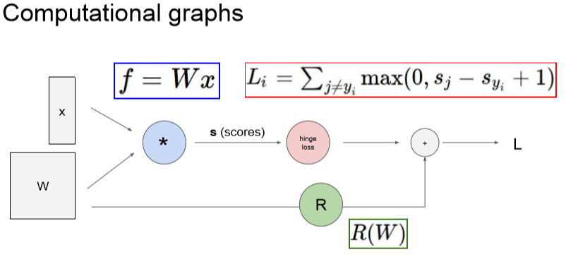

The advantage is that once we can express a function using a computational graph, then we can use a technique called **backpropagation** which is going to recursively use the **chain rule** in order to compute the gradient with respect of every variable in the computational graph.

#### How does backpropagation work?

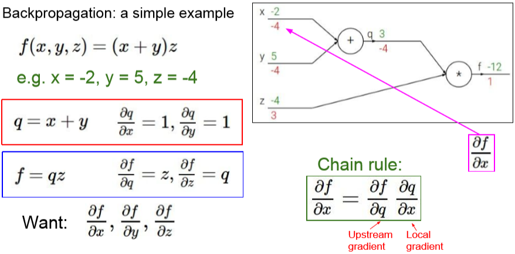

We start with a function in this case f(x, y, z) = (x + y)z, and we want to find the gradients of the output of the function with respect of the variables.

- The first step is we want to take our function *f* and we want to represent it using a computational graph.

- Then we do a **forward pass** to this network, so given the variables that we have. We are going to fill in the computational graph and then we can compute intermediate values.

- We want to give each intermediate node a name.

In this case we have q = x + y, and *f* = qz.

We also have the gradients written for q and *f* with respect to their variable.

- What we want is the gradients of x, y and z.

First, we start at the back of our computational graph and work our way backwards and compute all the gradients along the way.

df/df = 1

df/dz = q = x + y = -2 + 5 = 3

df/dq = z = -4

df/dy = df/dq * dq/dy = -4 * 1 = -4

df/dx = df/dq * dq/dx = -4 * 1 = -4

What we are doing in backpropagation is that we have all these nodes in the computational graph, but each node is only aware of their immediate surroundings.

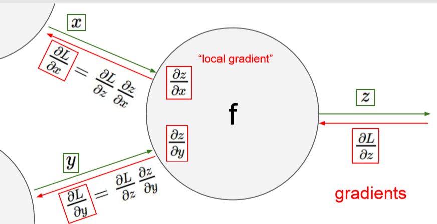

- Local inputs are x and y

- The immediate output is z

By the time we reach this node, we've already compute the gradient of our final loss L with respect to z. So what we want next is to find the gradients with respect to x and y using the chain rule.

The main thing to take away from this is that at each node, we just want our local gradient and during backpropagation, as we are receiving numerical values of gradients coming from upstream, we just take what that is, multiply it by the local gradient and then this is what we send back to the connected nodes.

### Another example

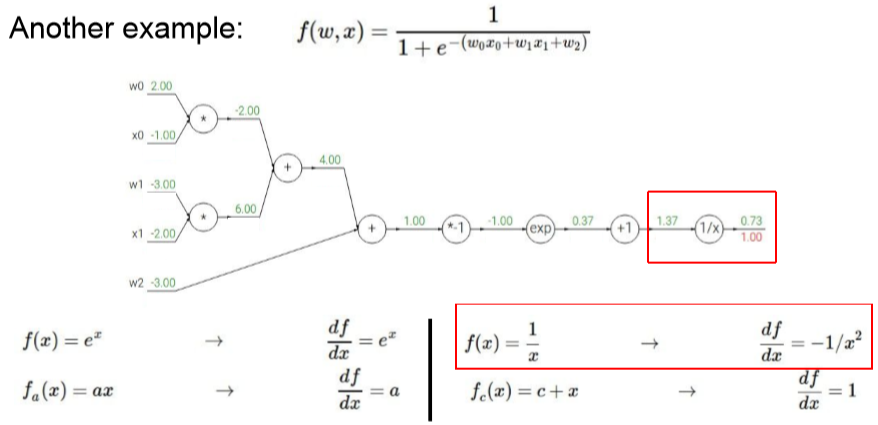

The gradient of the output with respect of the last variable is one.

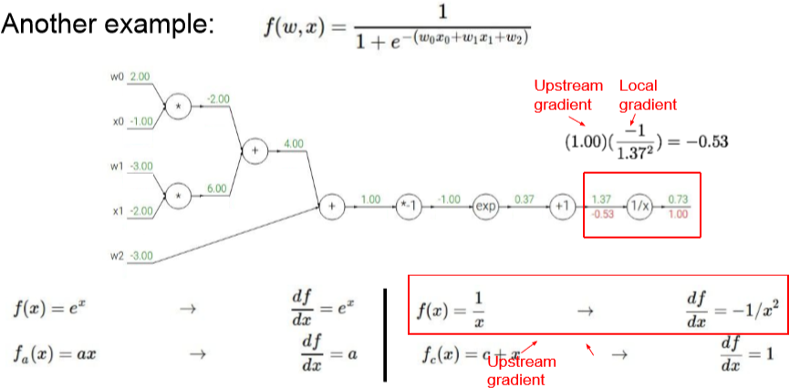

- The upstream gradient is equal to 1. 

- This node is one over x

f(x) = 1/x

- The local gradient of this node is:

df/dx = -1/x2

So we're going to take -1/x2 and plug in the value of x that we had during the forward pass, 1.37. 

Our final gradient is -1/1.372 * 1 = -0.53.

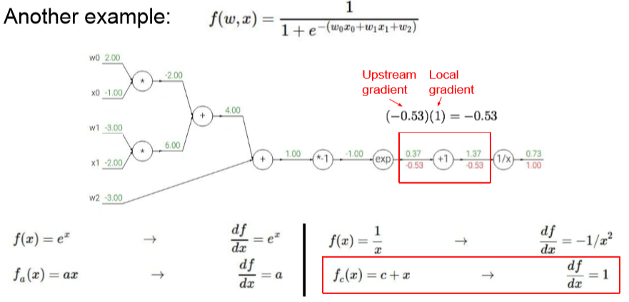

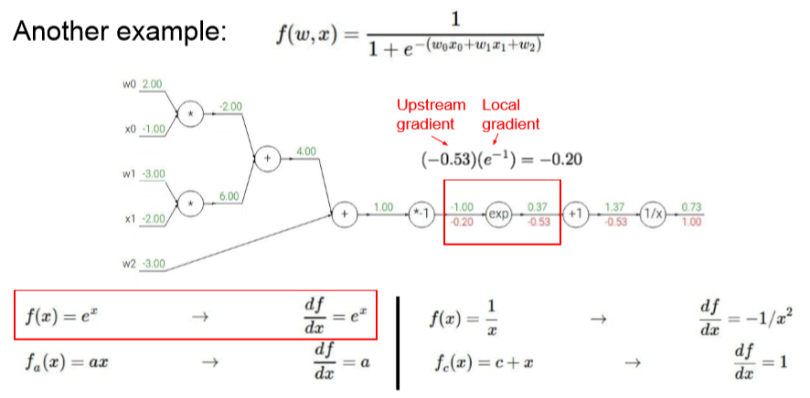

The upstream gradient is -0.53. The local gradient is ex. With the forward pass numerical value, we get e-1. 

Our final gradient becomes e-1 * -0.53 = -0.20

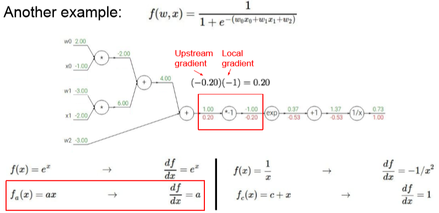

The local gradient is a. So using the forward pass value of 1, we get -1.

Our final gradient becomes with our upstream gradient of -0.20, -1 * -0.20 = 0.20.

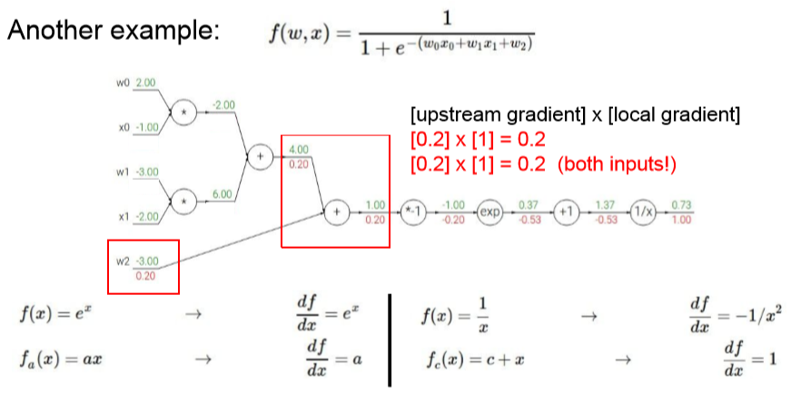

Here we have an addition node. So as we have seen from the simple example, the local gradient of an addition node is 1 for both inputs.

So our final gradient is 0.20 * 1 = 0.20 for both inputs.

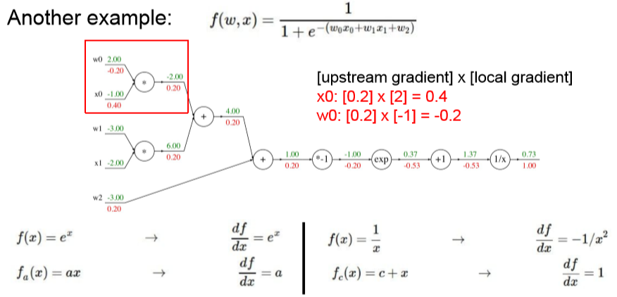

Here we have a multiplication node and we saw from the multiplication node in the simple example that the gradient with respect to one of the inputs is just the value of the other input.

- The upstream gradient is 0.20.
- The local gradient of w0 is -1.
- THe local gradient of x0 is 2.

So, x0 = 2 * 0.20 = 0.40.

w0 = -1 * 0.20 = -0.20.

**In practice**, we can group nodes together into more complex nodes if we want. As long we can write the local gradient for that node.

So this is basically a trade-off between how much math that you want to do in order to get a more concise and simpler graph versus how simple you want each of your gradients to be. And then you can write out as complex of a computational graph that you want.

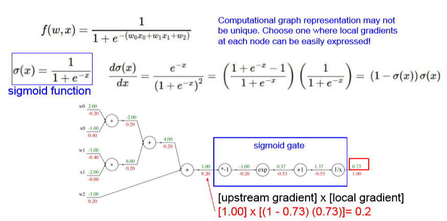

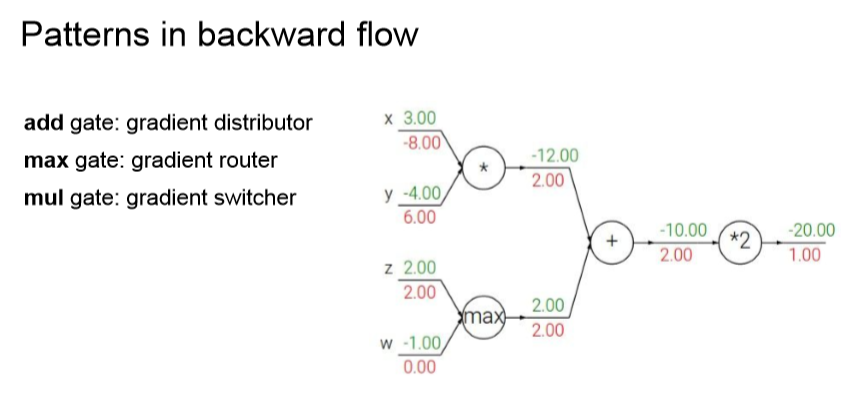

- The add gate is a gradient distributor

- The max gate is a gradient router
    - Takes the gradient and route it to one of the branches
    - If we look at the forward pass, only the value that was the maximum got passed down to the rest of the computational graph, so it's the only value that actually affected our function computation at the end, so it makes sense that when we are passing our gradients back, we just want to adjust the flow through that branch of the computation.

- The multiplication gate is a gradient switcher and scaler
    - We take the upstream gradient and we scale it by the value of the other branch.

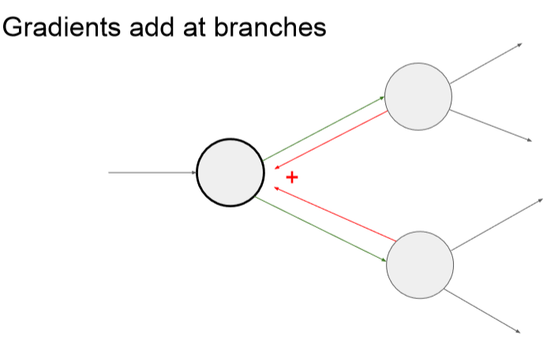

One thing to note is when we have a node is connected with multiple nodes, the gradients add up at this node. Using the multivariate chain rule, we're just going to take the value of the upstream gradient coming back from each of these nodes and we'll add these together to get the total upstream gradient that's flowing back into this node. 

We can think about this that if we're going to change this node a little bit, it's going to affect connected nodes in the forward pass. So then, when we are doing a backpropagation, connected nodes are going to affect again this node.

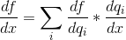

If x is connected to these multiples elements, in this case different qi's, then the chain rule is going to take the effect of each of these intermediate variables on our final output f and then compound each one with the local effect of our variable x on that intermediate value. So it's basically summing all these up together.

### Gradients for vectorized code

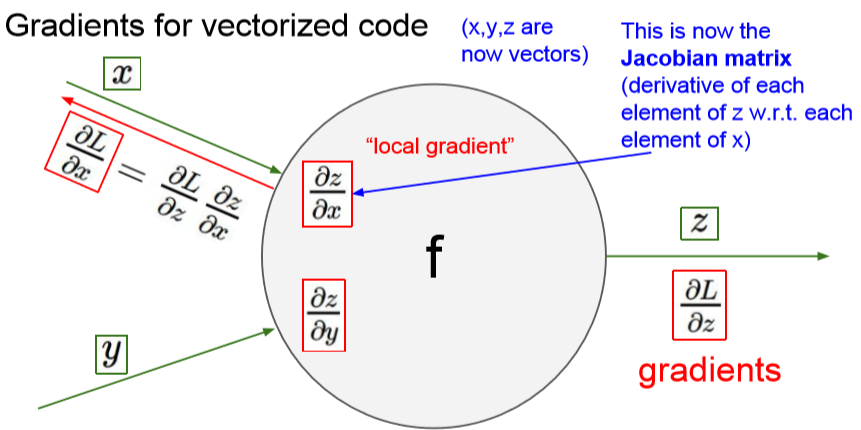

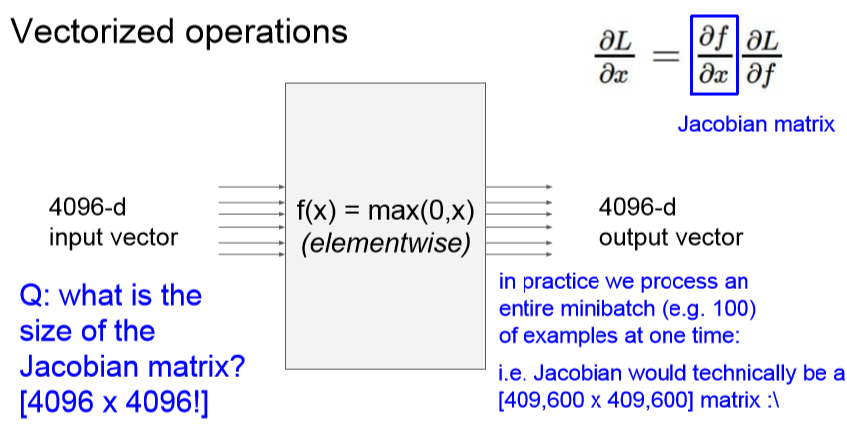

Each row is going to be partial derivatives that makes a matrix of partial derivatives of each dimension of the output with respect to each dimension of the input.

## Q: What sort of structure can see in our Jacobian matrix?

`It's diagonal`. Because this is element-wise, each element of the input only affects that corresponding element in the output, which is just going to be a diagonal matrix.

**In practice**, we don't actually need to compute this huge Jacobian matrix.
We can just know the effect of x on the output and we can use these values and fill it in as we're computing the gradient.

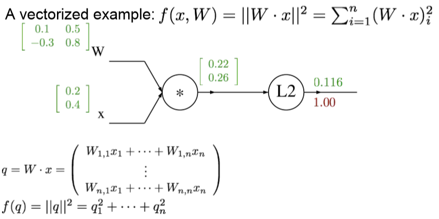

Now we want to find the gradient with respect to q for our intermediate variable before L2

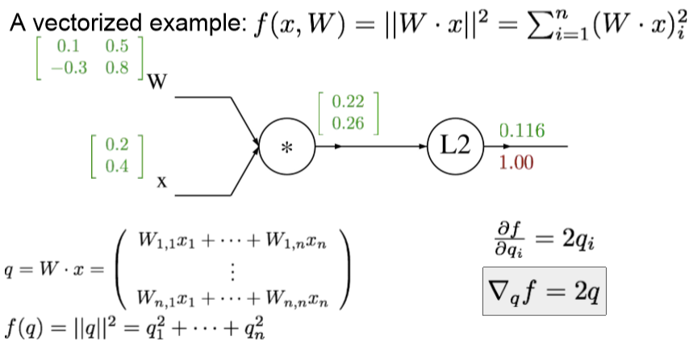

So q is a 2-dimensional vector, what we want to do is find how each element of q affects our final value f. So we have this expression with respect to each element of qi. It's also just going to be 2 times our vector of q.

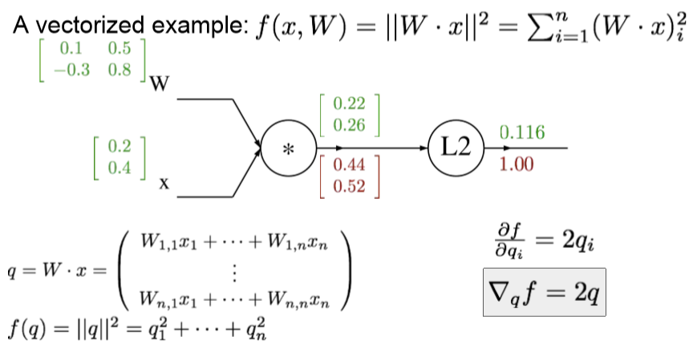

So the gradient of a vector will always going to be the same size as the original vector and each element of this gradient means how much of this particular element affects our final output of the function.

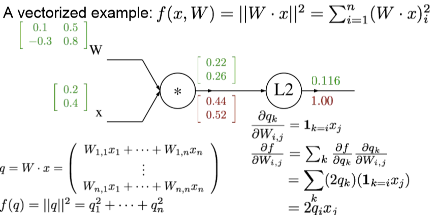

What's the gradient with respect to W?

Let's look this element-wise, we want to see the effect of each element of q with respect to each element of W.

What's the gradient of the first element of q, so q1 with respect to W 1,1?

X1

So we can write this generally with the gradient of qk with respect to Wi,j is equal to xj

Now we want to find the gradient of f with respect to each Wi,j

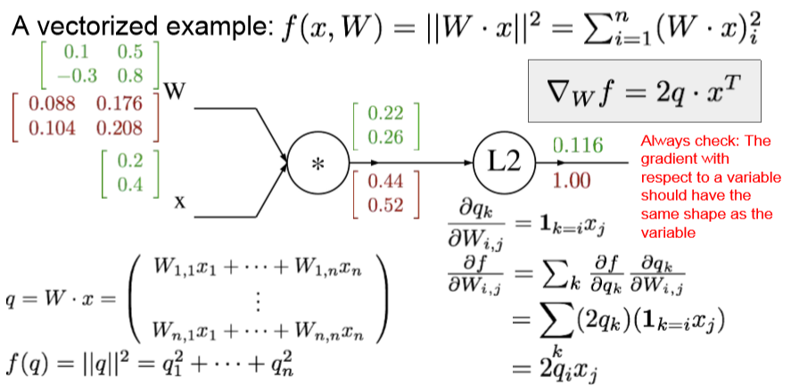

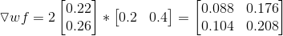

The gradient should have the same shape as the variable since each element of the gradient is quantifying how much that element is affecting the final output.

## Q: What does 1k=i mean?

It just means that it is one if k equals i.

Now we want to find the gradient of f with respect to xi

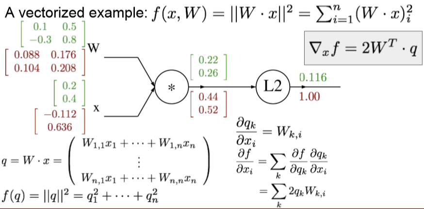

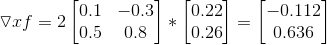

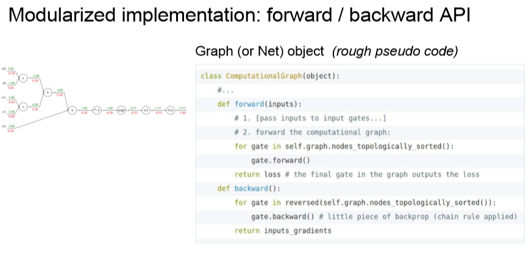

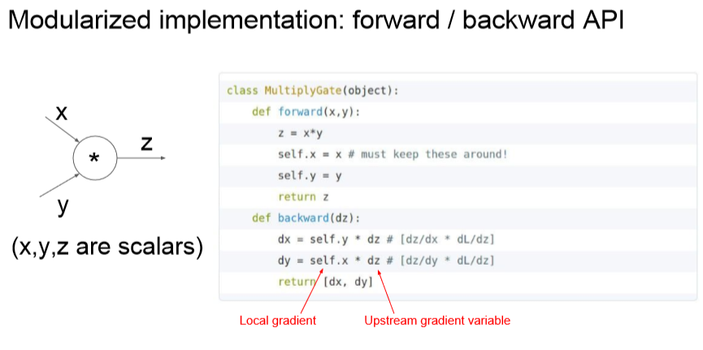

One thing that's important is that we should cache the values of the forward pass because we end up using this in the backward pass a lot of the time.

## Deep learning frameworks

### Caffe layers

In the source code, you'll find some directory called layers which are basically computational nodes, usually layers might be slightly more complex computational nodes.

Our network is just going to be stacking up all of these, the different layers that we choose to use in the network.

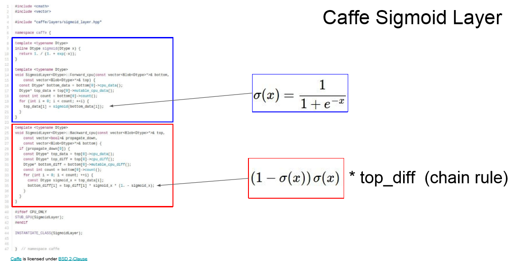

## Summary

- Neural nets will be very large: impractical to write down gradient formula by hand for all parameters

- **Backpropagation** = recursive application of the chain rule along a computational graph to compute the gradients of all inputs/parameters/intermediates

- Implementations maintain a graph structure, where the nodes implement the **forward()** / **backward()** API 

- **Forward**: compute result of an operation and save any intermediates needed for gradient computation in memory 

- **Backward**: apply the chain rule to compute the gradient of the loss function with respect to the inputs

## Neural Networks

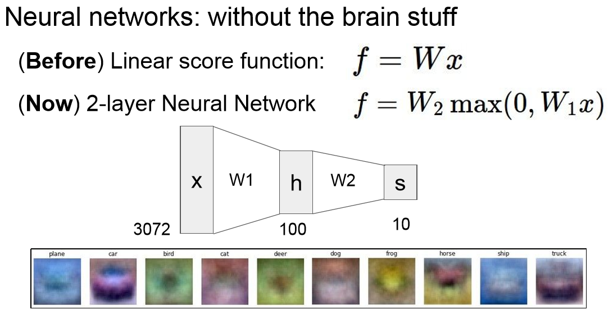

We've been using the linear function as a running example of a function that we want to optimize.

If we want a neural network where we can just in its simplest form, stack two of these together in order to get a 2-layer neural network.

It's really important to have these non-linearities in place because otherwise if you just stack linear layers on top of each other, they're just going to collapse to a single linear function.

Broadly speaking, neural networks are a class of functions where we have simpler functions that are stacked on top of each other and we stack them in a hierarchical way in order to make up a more complex non-linear function. This is the idea of having multiple stages of hierarchical computation. 

Before we had this problem of only one template. Now with this multiple layers network allows to do is each of this intermediate variable h, W1 can still be these kinds of templates and now you have all these scores for these templates in h, and we can have another layer on top that's combining these together. We have this matrix W2 which is now weighting of all of our vector in h.

## Q: If our image x is like a left-facing horse and in W1 we have a template of a left-facing horse and right-facing horse, then what's happening?

In h you might have a really high score for your left-facing horse and a lower score for your right-facing horse and W2 is a weighted sum of these templates. But if you have either a really high score for one of these templates or a lower or medium score for both of these templates, all of these kind of combinations are going to give really high scores. So in the end, you'll get is something that generally scores high when you have a horse of any kind.

## Q: Who's doing the weighting, is it W2 or h?

W2 is doing the weighting. h is the value of the scores for each of your templates that you have in W1. h is like a score function, it's how much of each template in W1 is present and then W2 is going to weight all of these intermediate scores to get your final score for the class.

**In practice**, it's not exactly like this because there's all these non-linearities thrown in, but it has this approximate type of interpretation to it.

## Q: Is h W1x?

h is just W1 times x with the max function on top.

The term deep neural networks come from this idea that you can stack multiple of these layers.

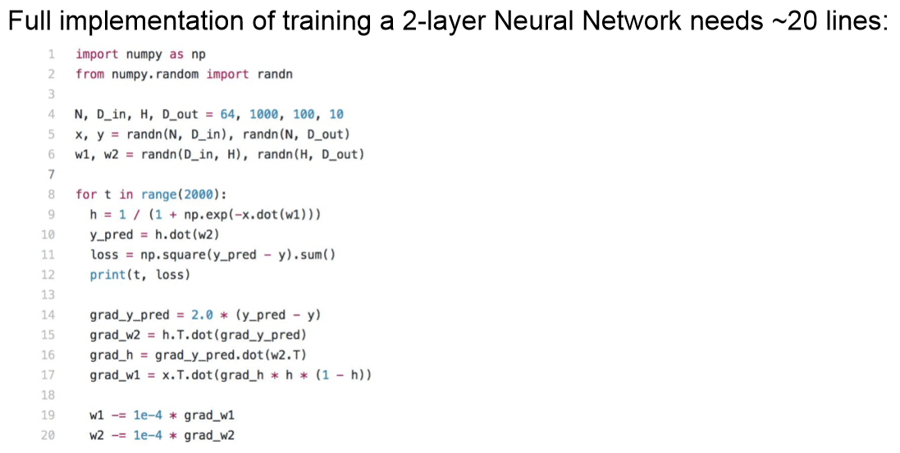 

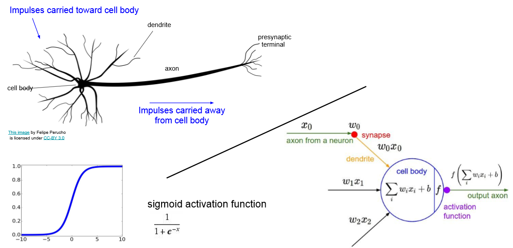

We have the impulses that are carried towards each neuron and we have a lot of neurons connected together. Each neuron has dendrites, these are what receives the impulses that come into the neuron.

The cell body integrates these signals coming in and passes on, the impulses carries away from the cell body to downstream neurons that it's connected to. It carries away through axons.

Nodes are connected to each other in a computational graph, we have inputs or signals x coming into a neuron, all of theses x's are combined and integrated together using for example our weights W.

Then we have the `activation function` that we apply on top and we get this value of the output and we pass it down to the connecting neurons.

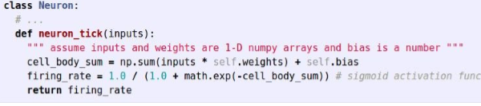

**In practice**, neuroscientists who are actually studying this say that one of the non-linearities that are most similar to the way that neurons are actually behaving is a ReLU function. It's a function that's at zero for all negative values of input and then it's a linear function for everything that's in the positive regime.

It's really important to be extremely careful with making any of these sorts of brain analogies because in practice, biological neurons are way more complex than this.

Biological neurons:
- Many different types
- Dendrites can perform complex non-linear computations
- Synapses are not a single weight but a complex non-linear dynamical system
- Rate/firing rate code may not be adequate (neurons will fire at a variable rate)

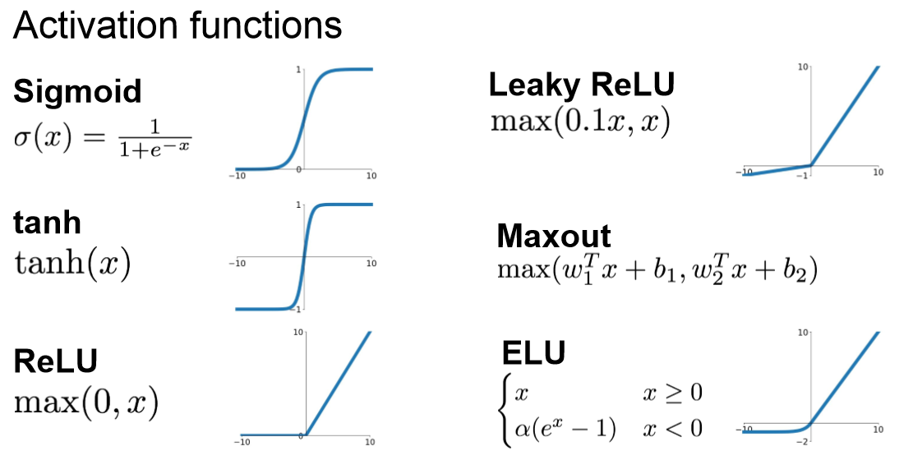

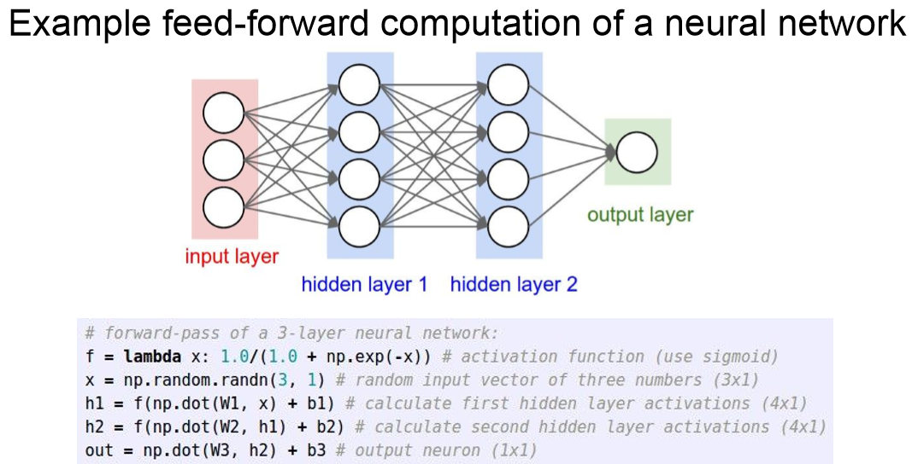

- **Fully-connected** layers
- 3-layer Neural Net or 2-hidden-layer Neural Net

## Summary

- We arrange neurons into fully-connected layers 
- The abstraction of a layer has the nice property that it allows us to use efficient vectorized code (e.g. matrix multiplies) 
- Neural networks do have some analogy and loose inspiration from biology, but they're not really neural