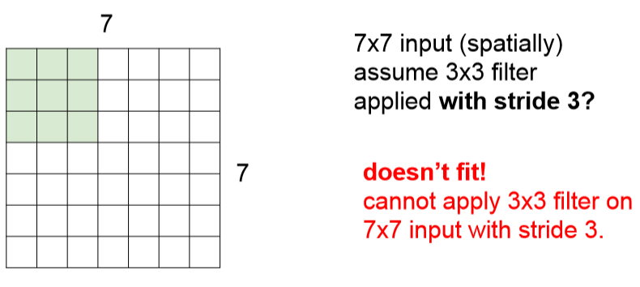

# CS231n - Lecture 5 notes

[Stanford University CS231n, Spring 2017 - Lecture 5](https://www.youtube.com/watch?v=bNb2fEVKeEo&list=PLC1qU-LWwrF64f4QKQT-Vg5Wr4qEE1Zxk&index=4)

## Convolutional Neural Networks

Fast forwarding today, we have the initial classification results on ImageNet from Alex Krizhevsky. It is able to do a really good job on image retrieval. The features that are learned are really powerful for doing similarity matching.

We also have ConvNets that are used for detection. We're able to do a good job of localizing where in an image is, for example, a bus or a boat and draw precise bounding boxes around that. We're able to go even deeper beyond that to do segmentation where we're not looking just for the bounding box, but we're actually going to label every pixel in the outline of trees and people and so on.

These kind of algorithms are used in, for example, self-driving cars, and a lot of this is powered by GPUs that's able to do parallel processing and able to efficiently train and run these ConvNets.

Some other applications where ConvNets are used for, such as face recognition. They are also applied to video.

This is an example of a video network that looks at both images as well as temporal information and from there it is able to classify videos.

We're also able to do pose recognition, be able to recognize shoulders, elbows and different joints.

They're also used in game playing. Some of the work in reinforcement learning, deeper enforcement learning playing Atari games, Go and so on. ConvNets are an important part of all of these.

They're being used for interpretation and diagnosis of medical images, for classification of galaxies, for street signs recognition.

We also have examples of looking at aerial maps and being able to draw out where are the streets on these maps, the buildings and being able to segment all of these.

And beyond recognition of classification detection, we also have tasks like image captioning, where given an image we want to write a sentence description about what's in the image.

In artwork, using neural networks, there's Deep Dream on the left where we are able to take images and hallucinate different kinds of objects and concepts in an image. There's also neural style where we take an image and we're able to re-render this image using a style of a particular artist and artwork.

## Fully Connected Layer

32x32x3 image that we stretch to 3072 x 1

The input image will be a 3072 dimensional vector. Then we're going to multiply this by a weight matrix of 10 x 3072. We take each of our 10 rows and do the dot product with the 3072 dimensional input. From there we'll get this one number that's going to be the value of the neuron. In this case, we're going to have 10 of these neuron outputs.

The convolutional layer, the main difference between this and the fully connected layer is that here we want to preserve spatial structure.

## Convolution Layer

Instead of stretching the 32x32x3 image into one long vector, we're going to keep this structure of this image. And then what we're going to do is, our weights are going to be these small filters. In this case, for example, a 5x5x3 filter. We are going to take this filter and slide it over the image spatially and compute dot products at every spatial location.

Our filters always extend the full depth of the input volume.

## Q: When we do the dot product, do we turn the 5x5x3 filter into one vector?

Yes, in essence that's what we're doing. We can think of it as just plopping it on and doing the element-wise multiplication at each location, but this is going to give the same result as if you stretched out the filter at that point, stretched out the input volume that's laid over and then took the dot product.

## Q: Should we rotate the kernel by 180 degrees to better match the convolution, the definition of convolution?

What we are actually technically doing is we're convolving with the flipped version of the filter. But for the most part, we just don't worry about this.

To begin sliding the filter, we start at the upper left-hand corner and basically center our filter on top of every pixel in this input volume. And at every position, we're going to do this dot product and this will produce one value in our output activation map.

When we're dealing with a convolutional layer, we want to work with multiple filters because each filter is looking for a specific type of template or concept in the input volume.

We can do this for as many filters as we want to have in this layer. For example if we have 6 filters, six of these 5x5x3 filters, then we're going to get in total 6 activation maps out.

A preview on how we use these convolutional layers in our convolutional network is that our ConvNet is going to be a sequence of these convolutional layers stacked on top of each other, the same way as what we had before with the simple linear layers in their neural network. And then we're going to intersperse these with activation functions, for example, a ReLU activation function.

## Q: What's the intuition of increasing the depth each time?

Here we have 5x5x3 filters in the original layer and then 5x5x6 filters in the next layers, this is mostly a design choice. In practice, people may have found certain types of these configurations to work better.

When you look at multiple of these layers stacked together in a ConvNet, what ends up happening is you end up learning this hierarching of filters, where the filters at the earlier layers usually represent low-level features that you're looking for. For example, edges.

At the mid-level, you're going to get more complex kind of features, maybe like corners and blobs and so on.

And then at higher-level features, you're going to get things that are starting to more resemble concepts than blobs.

Even though we didn't explicitly force our ConvNet to learn these kinds of features, **in practice** when you give it this type of hierarchical structure and train it using backpropagation, these are kinds of filters that end up being learned.

## Q: What are we seeing in these visualizations?

If we look at this Conv1, the first convolutional layer, each of these grid, each part of this grid is one neuron. 

So what we visualize here is what in the input would look like that maximizes the activation of that particular neuron. So what sort of image you would get that would give you the largest value. So in a sense, what is the neuron looking for.

Each of these activation maps is kind of the output of sliding one of these filters over and where this sort of template is more present in the image.

We're going to have a convolutional layer first. We usually have our non-linear layer after that. So ReLU is something that's very commonly used. THen once in a while we'll use a pooling layer that basically downsamples the size of our activation maps. At the end of this we'll take our last convolutional layer output and then we're going to use a fully connected layer and use that to get a final score function.

### Spatial dimensions

We're going to compute the dot product, get one value for our activation map and then slide to the right by one.

We slide horizontally and vertically to finally get a 5x5 output because what fit was basically sliding this filter a total of five spatial locations horizontally and five spatial locations vertically.

There are different kinds of design choices that we can make. The interval at which we slide is called `stride`. Previously we used a stride of 1.

Here we use a stride of 2.

We get an output of 3x3 as we slide by 2 pixels horizontally to the right. And then slide 2 pixels vertically from the start and continue to slide to the right.

**In practice**, we don't do convolutions like this because it's going to lead to asymmetric outputs happening.

### Output size formula

We can calculate the output size with this formula where We take our dimension of our **input N**, our **filter size F** and our **stride**.

**In practice** it's actually common to zero pad the borders in order to make the size work out to what we want it to.

Pretty common filter sizes are:
- 3x3 with a zero pad of 1
- 5x5 with a zero pad of 2
- 7x7 with a zero pad of 3

## Q: If I have the same input 7x7, 3x3 filter and stride 1, but now with a padding of one pixel border, what's the size of the output going to be?

7x7 output since the dimension of our input becomes N = 9 with the padding.

WIth the formule, we'll get (9 - 3) / 1 + 1 = 6 + 1 = 7

## Q: What's the actual output of the size, is it 7x7 or 7x7x3?

The output is going to be 7x7 x # of filters that you have.

Each filter is going to do the dot product through the entire volume of your input volume. But then that's going to produce one number. Each filter is producing in this case, a 1x7x7 activation map output, and so the depth is going to be the number of filters that we have.

## Does zero padding add some sort of extraneous features at the corner?

We're doing our best to still get some value and process that region of the image. So zero padding is kind of one way to do this where we can detect part of this template in this region. There's also other ways to do this, you can try to mirror the values or extend them, and so it doesn't have to be zero padding, but in practice this is one thing that works reasonably.

## Q: So if we have a non-square image, do we ever use a stride that's different horizontally and vertically?

There's nothing stopping you from doing that, but in practice we usually take the same stride, we usually operate square regions.

## Q: Why do we do zero padding?

To maintain the same input size as we had before for our size output. It also helps to apply filters at these corner regions and edges regions.

If we don't do zero padding, or any sort of padding we'll quickly shrink the size of the outputs that we have. This is not something that we want.

We can imagine that we have a pretty deep neural, then very quickly the size of your activation maps is going to shrink to something very small. And this is bad because we're losing out on some of this information by using a much smaller number of values to represent the original image. At the same time, we're losing some edge information, corner information each time we're shrinking that further.

(N - F) / stride + 1

- N = 32
- F = 5 
- stride = 1
- pad = 2

We padded it by 2 in each dimension, so total width and total height's going to be 32 plus 4 on each side.

(32 + 4 - 5) / 1 + 1 = 32 spatially

Output volume size = 32x32x10

Each of the filters is 5x5 spatially and implicitly go through the whole volume of the input. 

In practice each filter has 5x5x3 weights, plus our one bias term.

We have 76 parameters per filter, and then we have 10 of these total. So 760 parameters.

## Q: What's the intuitiion in choosing the stride?

One sense it's kind of the resolution at which you slide it on. When we have a larger slide, what we end up getting as the output is a downsampled image and so what this downsampled image lets us have is this effect of pooling and then also as you're doing this, you're reducing the size of the activation maps that you're dealing with at each layer and so this also affects later on, the total number of parameters that you have.

For example at the end of all your Conv layers, now you might put on fully connected layers on top, and now the fully connected layer's going to be connected to every value of your convolutional output. So a smaller one will give you a smaller number parameters.

 

If you look at the filters across in one spatial location of the activation volume and going through depth of these 5 neurons, all of these neurons, the way we can interpret this is that they're all looking at the same region in the input volume, but they're just looking for different things. So they are different filters applied to the same spatial location in the image.

Comparing with the fully connected layer, if we look at each of the neurons in our activation or output, each of the neurons was connected to the entire stretched out input, so it looked at the entire full input volume compared to now where each one just looks at this local spatial region.

## Pooling Layer

It makes the representation smaller, so it effects the number of parameters that you have at the end and does some invariance over a given region.

It takes your input volume, for example 224x224x64 and `spatially downsamples` this.

It is important to note that this doesn't do anything in the depth, we're only pooling spatially. So the input depth is going to be the same as your output depth.

Our pooling layer also has a filter size and a stride.

So in this case, we're going to slide it among our input volume in exactly the same way we did for convolution.

But here instead of doing these dot products, we're just going to take the maximum value of the input volume in that region.

## Q: Is it typical to set up the stride so that there isn't an overlap?

For the pooling, yes it is the more common thing to do is to have them not have any overlap. Basically we just want to downsample, and it makes sense to just look at this region and just get one value to represent this region and then look at the next region and so on.

## Q: Why is max pooling better than doing something like average pooling?

Average pooling is something that we can do and the intuition behind why max pooling is commonly used is that we can think of max pooling as saying, giving a signal of how much did this filter fire at any location in this image.

If we're thinking about detecting or doing recognition, this might make some intuitive sense where you're saying, whether a light or whether some aspect of your image that you're looking for, whether it happens anywhere in this region we want to fire at with a high value.

## Q: Since pooling and stride both have the same effect of downsampling, can you just use stride instead of pooling and so on?

**In practice**, looking at more recent neural network architectures, people have begun to use stride more in order to do the downsampling instead of pooling. Fractional strides are also things that you can do. And maybe in practice, it has been a better way to get better results using that.

Requires 3 hyperparameters:
- Filter size
- their spatial extent F
- the stride S

You can compute the output volume using the same equation used earlier for convolution, it still applies here.

Typically people don't really use zero padding for the pooling layers because you're just trying to do a direct downsampling.

At the last layer, we stretch out the output volume (W x H x D) and pass on a fully connected layer.

After your convolutional layer, the outputs for the first column is basically how much do specific, for example, edges fire at different locations in the image. Then as you go through you're going to get more complex, it's going to look for more complex things. So the next convolutional layer is going to fire at how much let's say certain kinds of corners show up in the image because it's reasoning on top of edge maps, and so that allows it to get more complex.

By the time you get all the way up to this last pooling layer, each value is representing how much a relatively complex sort of template is firing. Because of that, now you can just have a fully connected layer and aggregate all of this information together to get a score for your class.

## Q: When do you know you've down enough pooling to do the classification?

Try and see. It's a trade-off between something reasonable versus people that have tried a lot of different configurations so you'll probably cross validate and try over different pooling sizes, different filter sizes, different number of layers and see what works best for your problem. Because every problem with different data is going to require different set of these sort of hyperparameters.

## Summary

