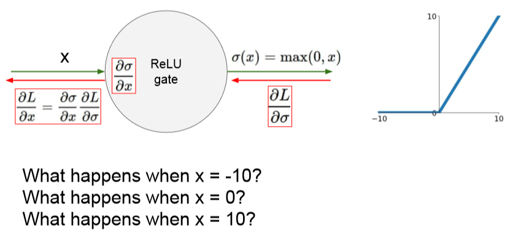
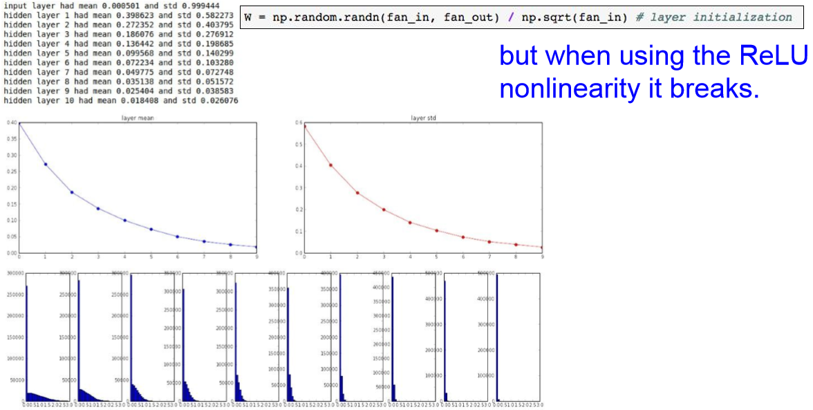
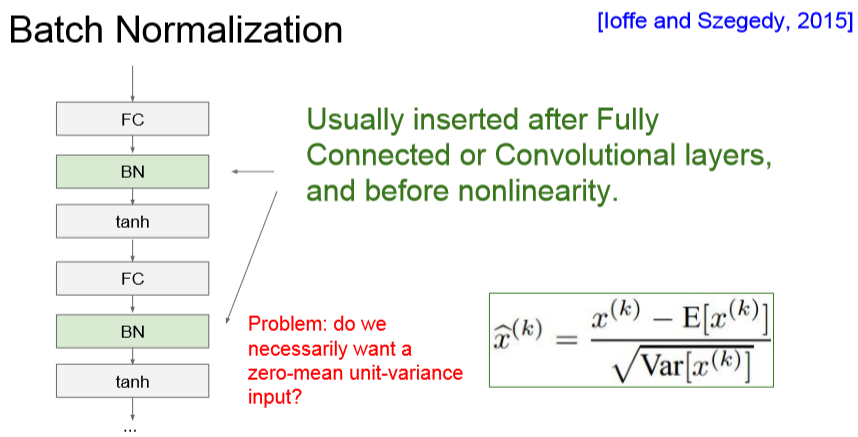
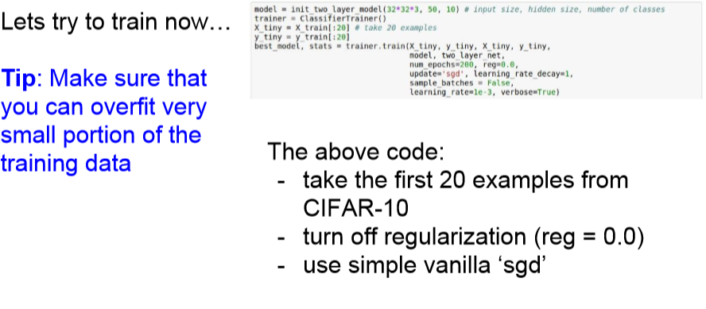

# CS231n - Lecture 6 notes

[Stanford University CS231n, Spring 2017 - Lecture 6](https://www.youtube.com/watch?v=wEoyxE0GP2M&index=5&list=PLC1qU-LWwrF64f4QKQT-Vg5Wr4qEE1Zxk)

## Training Neural Networks I

### Activation Functions

### Sigmoid

- Squashes numbers to range [0,1]
- Historically popular since they have nice interpretation as a saturating "firing rate" of a neuron

#### 3 problems
- Saturated neurons "kill" the gradients
- Sigmoid outputs are not zero-centered
- exp() is a bit computationally expensive

## Q: What happens when x = -10?

The gradient becomes 0 and we chain any upstream gradient by multiplying near 0 and we will get a very small gradient. After the chain rule, this "kills" the gradient flow.

## Q: What happens when x = 0?

You get a reasonable gradient. It will be fine for backpropagation.

## Q: What happens when x = 10?

The gradient becomes 0. The sigmoid function region is going to be flat and then "kills" off the gradient and then weren't going to get a gradient flow coming back.

## Q: What happens when the input to a neuron is always positive? What can we say about the gradients on w?

It is always going to be all positive or all negative.
Our upstream gradient is either positive or negative. Our local gradient that we multiply this by if we're going to find the gradients on w is going to be df/dW which is x. If x is always positive then the gradients on w which is multiplying these two together are going to always be the sign of the upstream gradient.

We want zero-mean data so we get positive and negative values and we don't get into this problem where the gradient updates w all moving in the same direction.

### Tanh

- Squashes numbers to range [-1,1]
- Zero centered
- Still kills gradients when saturated 

### ReLU (Rectified Linear Unit)

- Does not saturate (in positive region)
- Very computationally efficient
- Converges much faster than sigmoid/tanh in practice (e.g. 6x)
- Actually more biologically plausible than sigmoid
- Not zero-centered output

## Q: What happens when x = -10?
The gradient is 0

## Q: What happens when x = 0?
The gradient is undefined here, but in practice we'll say 0

## Q: What happens when x = 10?
The gradient is good, it is in the positive regime

The dead ReLU will never activate and update. It can happen when you have bad initialization, if you have weights that happen to be unlucky, then they're never going to have a data input that causes to activate, so they aren't going to get gradient flow coming back. So it will never be updated.

A common case is when your learning rate is too high.

The parametric Rectifier is just like a leaky ReLU where we have this sloped region in the negative space, but now the slope in the negative regime is determined through this alpha parameter, so we don't specify/hard-code it, but we treat it as a parameter that we can backprop into and learn. This gives it a little more flexibility.

### Maxout "Neuron"

- Does not have the basic form of dot product : nonlinearity
- Generalizes ReLU and Leaky ReLU
- Linear regime, doesn't saturate, doesn't die
- **Problem:** doubles the number of parameters/neuron

### Data Preprocessing

**In practice**, we do the zero centering, but we don't actually normalize the pixel value so much because generally for images, at each location you already have relatively comparable scale and distribution. And so we don't really need to normalize so much compared to general machine learning problems where you might have different features that are very different and of very different scales.

With images, we typically stick with the zero mean. One reason for this is generally with images, we don't really want to take all of our input and project this onto a lower dimensional space. We typically just want to apply convolutional networks spatially and have our spatial structure over the original image.

## Q: Do we do preprocessing in the training phase and test phase?

Yes. In general, on the training phase is where we determine our mean and then we apply this exact same mean to the test data.

**In practice**, we can also for some networks, we can subtract per-channel mean, so instead of having an entire mean image that were going to zero-center by, we just take the mean by channel.

This is just because it turns out that it was similar enough across the whole image, it didn't make such a big difference to subtract the mean image versus a per-channel value. And this is easier to just pass around and deal with.

## Q: Do we do this for the entire training set once before we start training?

Yes. We don't do this per batch.

## Q: Does the data preprocessing solve the sigmoid problem of zero mean?

The data preprocessing is doing the zero mean. It does solve this for the first layer that we pass it through. Later on, we're actually going to have this problem come up in much worse and greater form as we have deep networks. We're going to have a lot of nonzero mean problems later on.

In this case, this is not going to be sufficient. So this only helps at the first layer of your network.

### Weight Initialization

Given an input, if our W is constant, every neuron will have the same operation on top of the inputs. Since they're all going to output the same thing, they're also all going to get the same gradient. And so, because of that they're all going to update in the same way. All neurons are going to be the same which is **not** what you want. That's the problem when you initialize everything equally.

The problem is that as we multiply by this W, these small numbers at each layer, this quickly shrinks and collapse all of these values.

## Q: What do the gradient look like?

We have these input values that are very small at each layer because they've all collapsed near zero. Then at each layer we have our upstream gradient flowing down. In order to get the gradient on the weights, it's just going to be X, which is our inputs. Since X is small, our weights are getting a very small gradient and they're basically not updating.

If our weights are now all big and we're taking these outputs of W times X and passing them through tanh nonlinearities, we will get saturated outputs with gradients of 0.

Intuitively, if you have a small number of inputs, then we're going to divide by the smaller number and get larger weights.

We need larger weights because with small inputs and by multiplying each of these by weight, you need larger weights to get the same larger variance at output.

Similarly, if we have many inputs then we want smaller weights in order to get the same spread at the output.

- It is assumed that there's linear activations

The problem is that this breaks when now you use something like ReLU.

Because it's killing half of your units, it's setting approximately half of them to zero at each time, it's actually halving the variance that you get out of this.

We get this same phenomenon as the distributions starts collapsing. In this case you get more and more peaked toward zero and more units deactivated.

The way to address this is that you can try to account by adding an extra /2. We're basically adjusting for the fact that half the neurons get killed.

**In practice**, this is been really important for training these type of little things. It is important to really pay attention to how your weights are. In some papers, this actually is the difference between the network even training at all and performing well versus nothing happening.

A good general rule of thumb is basically use the Xavier initialization to start with and then you can also think about some of these other kinds of methods.

### Batch Normalization

1. Compute the empirical mean and variance independently for each dimension, so basically each feature element and we compute this across our batch

2. Normalize

So for a convolutional layer, we're going to have one mean and one standard deviation per activation map that we have and we're going to normalize across all of the examples in the batch.

We also have this additional squashing and scaling operation. We're going to scale by some constant gamma and then shift by another factor of beta.

- This allow you to be able to recover the identity function if you wanted to.

The network could learn your scaling factor gamma to be just your variance and it could learn your beta to be your mean, and in this case you can recover the identity mapping as if you didn't have batch normalization.

- Now you have the flexibility of doing everything in between and make the network learn how to make your tanh more or less saturated.

Now at the output of each layer, each of these outputs is an output of both your input X as well as the other examples in the batch. Because you're going to normalize each input data by the empirical mean over that batch, it's not longer producing deterministic values for a given training example and it's tying all of these inputs in a batch together. So because this is no longer deterministic it gives some sort of regularization effect.

## Q: Is gamma and beta are learned parameters?

Yes.

## Q: Why do we want to learn these parameters gamma and beta to get the identity function back?

You want to give the flexibility, what batch normalization is doing is it's forcing our data to become this unit gaussian. Even though in general this is a good idea, it's not always that this is the best thing to do. In particular for tanh, you might want to control some degree of saturation that you have.

So what this does is it gives you the flexibility of doing this unit gaussian normalization if it wants to, but also learning that maybe in this particular part of the network, maybe it's not the best thing to do. Maybe it's in the right general idea but slightly different, slightly scaled or shifted. So these parameters just give it that extra flexibility to learn that if it wants to. And then, if the best thing to do is just batch normalization, it'll learn the right parameters for that.

We apply batch normalization separately to each of these neurons.

## Q: If we force the inputs to be gaussian, do we lose the structure?

No in a sense that if you had all your features distributed as a gaussian, even if you were just doing data preprocessing, this gaussian is not losing you any structure. It's just shifting and scaling your data in a regime that works well for the operations that you're going to perform.

## Q: Are we normalizing the weight so that they become gaussian?

We're normalizing the inputs to each layer, so we're not changing the weights in this process.

## Q: If we're going to be doing the shift and scale and learning these, is the batch normalization redundant because you could recover the identity mapping?

In the case that the networks learns that identity mapping is always the best and it learns these parameters, then yes there would be no point in batch normalization.

But **in practice** this doesn't happen. We will learn this gamma and beta that's not the same as the identity mapping, it will shift and scale by some amount, but not the amount that's going to give you an identity mapping. You still get this batch normalization effect.

In the extreme, it could learn the identity mapping, but in practice it doesn't.

**Note**:
When we're doing this, we're actually getting zero mean and unit gaussian which put this into a nice shape, but it doesn't have to actually be a gaussian. Ideally, we would like it to have this gaussian effect.

### Babysitting the Learning Process

How do we monitor training, and how do we adjust hyperparameters as we go to get good learning results?

Then the first thing we want to do is we initialize our network. We do a forward pass through it and we want to make sure that our loss is reasonable and as expected.

Once the original loss is good, we add regularization and we want to see that our loss goes up.

Now we can start to train and a good way to do this is to start up with a very small amount of data. You should be able to overfit this very well and get very good training loss.

- Turn off regularization
- See if we can make the loss go down to zero

Now we can start training the full training data.

- Start with a small regularization
- Find a learning rate that makes the loss go down (**One of the most important hyperparameters**). It is something that we want to adjust first

Here the learning rate is too small, the gradient updates are not big enough and the cost is basically about the same.

## Q: We have a Softmax function in this case, our loss didn't really change, but our accuracy improved a lot. Why?

Here the probabilities are still pretty diffuse, so our loss term is still pretty similar, but when we shift all of these probabilities slightly in the right direction because we're learning. Now the accuracy all of a sudden can jump because we're taking the maximum correct value.

### Hyperparameter Optimization

Here we have a problem, we can see that our best accuracy has a learning rate that is in the negative four range. Since the learning rate that we specified was going from 10 to the negative four to 10 to the zero, that means that all the good learning rates were at the edge of the range that we were sampling.

This is bad because we might not have explored our space sufficiently, we might want to go to 10 to the negative five or 10 to the negative six. There might be still better ranges if we continue shifting down.

You want to make sure that your range has the good values somewhere in the middle or somewhere you get a sense that you've explored your range fully.

**In practice** it's actually better to sample from a random layout, so sampling random value of each hyperparameter in a range.

Basically we'll get much more useful signal overall since we have more samples of different values of the important variable.

Hyperparameters to play with:
- Network architecture
- Learning rate, its decay schedule, update type
- regularization (L2/Dropout strength)

**In practice**, you're going to do a lot of hyperparameter optimization and a lot of cross validation.

## Summary
- Activation functions (use ReLU)
- Data preprocessing (images: subtract mean)
- Weight initialization (use Xavier/He init)
- Batch normalization (use)
- Babysitting the learning process
- Hyperparameter optimization (random sample hyperparameters, in log space when appropriate)