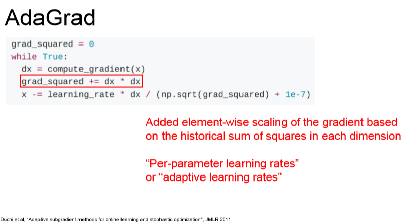
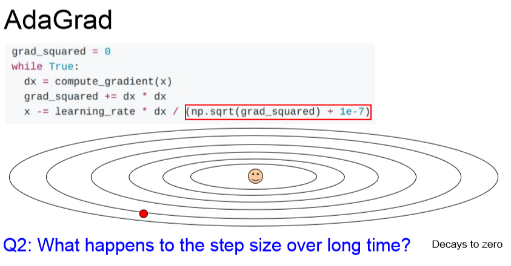

# CS231n - Lecture 7 notes

[Stanford University CS231n, Spring 2017 - Lecture 7](https://www.youtube.com/watch?v=_JB0AO7QxSA&index=7&list=PLC1qU-LWwrF64f4QKQT-Vg5Wr4qEE1Zxk)

## Training Neural Networks II

The direction of the gradient does not align with the direction towards the minima. When you compute the gradient and take a step, you might step over this line and zigzag back and forth. In effect, you will get very slow progress along the horizontal dimension, which is the less sensitive dimension and you get this zigzag behavior across the fast-changing dimension.

This kind of problems is more common in higher dimensions.

Saddle points are much more common in high dimension.

When you're training very large neural networks, the problem is more about saddle points and less about local minima. And also, the problem is not only at the saddle point but also near the saddle point. Since the slop is very small and we're stepping in the direction of the gradient and that gradient is very small, we're going to make very very slow progress.

## Q: If we were to use normal gradien descent, do all these problems go away?

The high condition problem is still a problem with full batch gradient descent. The noise. Saddle points are still a problem.

The idea is we maintain a velocity over time and we add our gradient estimates to the velocity. Then we step in the direction of the velocity rather than stepping in the direction of the gradient.

We also have this hyperparameter rho which corresponds to friction. Now at every time step, we take out our current velocity, we decay the current velocity by the friction constant rho which is something high like 0.9 or 0.99.

This simple strategy helps for all these problems.

If we think about happens at local minima or saddle points, if we imagine velocity in this system, we get this physical interpretation of a ball rolling down the hill, picking up speed as it comes down.

Now once we have velocity, then even when we pass that point of local minima, the point will still have velocity even if it doesn't have gradient. So hopefully we get over this local minima and continue downward.

There is a similar intuition near saddle points where even though the gradient around the saddle point is very small, we have this velocity vector that we've built up as we roll downhill. That can hopefully carry through the saddle point.

Once we're using momentum, it will effectively reduce the amount by which we step in the sensitive direction, whereas in the horizontal direction, our velocity will just keep building up and will actually accelerate our descent across the less sensitive dimension.

## Q: How does SGD momentum help with poorly conditioned coordinate?

If the gradient is very small and if rho is well behaved in this situation, then our velocity could monotonically increase up to a point where the velocity could now be larger than the actual gradient. Then we might make faster progress along the poorly conditioned dimension.

 

## Q: What's a good initialization for the velocity?

This is almost always zero.

## Q: What happens if your minima call lies in this very narrow basin? Will the velocity just cause you to skip right over that minima?

**In very recent theoretical work**, the idea is that when you have a sharp minima, that could be a minima that overfits more. If we imagine that we doubled our training set, the whole optimization landscape would change and maybe that very sensitive minima would dissapear if we were to collect more training data. 

So we have this intuition that we maybe want to land in very flat minima because those very flat minima are probably more robust as we change the training data. They might actually generalize better to testing data.

The idea with AdaGrad is that during the course of the optimization, you're going to keep a running sum of all the squared gradients that you see in training

The steps over time get smaller and smaller because we continue to update the estimate of the squared gradients over time, so this estimate just grows and grows over the course of training.

In the case of convex case, as you approach the minimum, you want to slow down so you actually converge.

In the non-convex case, that's a little problematic bacause as you come towards a saddle point, you might get stuck with AdaGrad.

Now with RMSProp, after we compute our gradient, we take our current estimate of the grad squared, we multiply it by this decay rate which is commonly 0.9 or 0.99 and add in this one minus decay rate of our current squared gradient.

We initialized our second timestep with zero. After one update of the second moment, typically this beta2 is 0.9 or 0.99, our second moment is still very close to zero. When we're making our second update and we divide by our second moment, now we're diving by a very small number. So we're making a very large step at the beginning.

## Q: What is this 10 to the minus seven term in the last equation?

That's actually appeared in AdaGrad, RMSProp and Adam. The idea is we're dividing by something, we want to make sure we're not dividing by zero.

## Q: What does Adam not fix?

In cases where you have this kind of rotated picture of poor conditioning, then Adam or any of these other algorithms really can't address that concern since we're making estimates along each dimension independently to allow us to speed up or slow down along different coordinate axes.

We don't have to stick with one learning rate, we see people decay the learning rate over time.

- Learning rate decay is a little bit more common with SGD momentum and a little bit less common with Adam. 

- Learning rate decay is kind of a second-order hyperparameter. You typically should **not** optimize over this thing at the start.

What you do for setting learning rate decay is try with no decay, see what happens. Then eyeball the loss curve and see where you think you might need decay.

- Compute the gradient at the red point
- Compute some linear approximation to our function with the gradient information
- We pretend that our first-order approximation is our actual function and we make a step to try to minimize the approximation

The idea here is that we only incorporate the information about the first derivative of the function.

- Take in account first and second derivative information

When you generalize this to multiple dimensions, you get something called Newton step

### L-BFGS

- Usually works very well in full batch, deterministic mode
- Does not transfer very well to mini-batch setting. Gives bad results. Adapting L-BFGS to large-scale, stochastic setting is an active area of research

**In practice**, Adam is a good default choice in most cases. If you can afford to do full batch updates and you know that your problem doesn't have any stochasticity then try L-BFGS (don't forget to disable all sources of noise).

### Beyond Training Error

All these optimization algorithms are really about driving down your training error and minimizing your objective function, but we don't really care about training error that much. Instead, we really care about our performance on unseen data.

We really care about reducing the gap between train and test error.

Once we're already good at optimizing our objective function, what can we do to try to reduce this gap and make our model perform better on unseen data?

Sometimes rather than training separate models independently, you can just keep multiple snapshots of your model during the course of training, then use these as your ensembles. Then you still, at test time, need to average the predictions of these multiple snapshots, but you can collect the snapshots during the course of training.

## Q: Is it bad when there's a large gap between error because that means you're overfitting, but if there is no gap, is it still bad? Do we want a small gap between the two?

We don't really care about the gap. We care about maximizing the performance on the validation set. If you don't see a gap, then you could have improved your absolute performance, in many cases, by overfitting a little bit more. There's this correlation between the absolute performance on the validation set and the size of that gap.

## Q: Are the hyperparameters the same for ensembles?

Sometimes they're not. You might want to try different size of the model, different learning rates, different regularization strategies and ensemble across these different things.

We add something to our model to prevent it from fitting the training data too well in the attempts to make it perform better on unseen data.

One thing that is super common for neural networks is this idea of Dropout.

## Q: What are we setting to zero?

It's the activations. Each layer is computing previous activation times the weight matrix gives you our next activation. Then you just take that activation, set some of them to zero, and your next layer will be partially zeroed activations times another matrix give you your next activations.

## Q: Which layer do you do this on?

It's more common in fully connected layers, but you sometimes see this in convolutional layers as well. When you're working with convolutional layers, sometimes instead of dropping each activation randomly, you sometimes might drop entire feature maps randomly. In convolutions, you have this channel dimension, and you might drop out entire channels rather than random elements.

- Dropout helps prevent co-adaptation of features

If we're trying to classify cats, the network might learn one neuron for having an ear, one for having a tall, etc. Then it combines these things together to decide whether or not it's a cat.

But if we have dropout, then in making the final decision about catness, the network cannot depend too much on any of these one features. Instead, it needs to distribute its idea of catness across many different features. This might prevent overfitting somehow.

Another interpretation is how dropout is learning a whole ensemble of networks all at the same time that all share the same parameters.

One thing you might imagine doing is approximating this integral via sampling, where you draw multiple samples of z and then average them out at test time, but this would still introduce some randomness which is a little bit bad.

During training, we used dropout probability 1/2 of dropping our neurons.

There's four possible dropout masks and we're going to average out the values across these four masks.

Maybe at test time, you care more about efficiency, so you want to eliminate that extra multiplication by p at test time. So what we can do is use the entire weight matrix at test time, but now at training time, instead you divide by p because training is probably happening on a GPU.

## Q: What happens to the gradient during training with dropout?

We only end up propagating the gradients through the nodes that weren't dropped. This has the consequence of taking longer to train because at each step, you're only updating some subparts of the network. When you're using dropout, it typically takes longer to train, but you might have a better generalization after it's converged.

When you train networks with batch normalization, sometimes you don't use dropout at all, and just the batch normalization adds enough of a regularization effect to your network.

Dropout is somewhat nice because you can actually tune the regularization strength by varying that parameter p, and there's no such control in batch normalization.

#### Random mix/combinations of:

- Translation
- Rotation
- Stretching
- Shearing
- Lens distortion
- etc.

DropConnect

- Rather than zeroing out the activations at every forward pass, instead we randomly zero out some of the values of the weight matrix instead.

Fractonal Max Pooling

- Every time we have our pooling layer, we're going to randomize the pool of the regions over which we pool.
- Now during test time, we average the stochasticity out by either sticking to some fixed set of pooling regions or drawming many samples and averaging over them.

Stochastic Depth

- During training, we're going to eliminate some layers and only use some subset of layers.
- During test time, we're going to use the whole network.

## Q: Do you use usually use more than one regularization method?

You should generally use batch normalization, it is a good thing to have in most networks nowadays because it helps you converge, especially for very deep things. In many cases batch normalization alone tends to be enough, but sometimes if batch normalization is not enough, you can consider adding dropout or other methods once you see the network overfitting.

One problem with overfitting is sometimes you overfit because you don't have enough data. You want to use a big, powerful model, but it is just going to overfit too much on your small dataset. Regularization is one way to combat that, another way is by transfer learning.

Whenever you have some problem that you want to tackle, but you don't have a large dataset, then you should generally download some pretrained model that's relatively close to the task you care about, and then either reinitialize parts of that model or fine tune that model for you data. That tends to work pretty well, even if you have only a modest amount of training data to work with.

## Summary
- Optimization (how to improve the training loss)
    - Momentum, RMSProp, Adam, etc.
- Regularization + Model ensembling (improving your performance on the test data)
    - Dropout, etc.
- Transfer learning (how to do better with less data)
